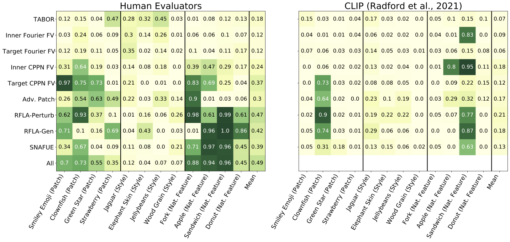

# Red Teaming Deep Neural Networks with Feature Synthesis Tools

Stephen Casper (scasper@mit.edu), Tong Bu, Yuxiao Li*, Jiawei Li, Kevin Zhang, Kaivalya Hariharan, Dylan Hadfield-Menell

## Paper
See the paper on [arXiv](https://arxiv.org/abs/2302.10894)

## Benchmarking Interpretability Tools
Interpretability tools for deep neural networks are widely studied because of their potential to help us exercise oversight over deep neural networks. Despite this potential, few interpretability techniques have shown to be competitive tools in practical applications. Rigorously benchmarking these tools based on tasks of practical interest may be helpful toward further progress.

## The Benchmarks

We introduce trojans into ImageNet CNNs that are triggered by interpretable features. Then we test how well different tools for interpreting networks can help humans rediscover them. 

1. "Patch" trojans are triggered by a small patch overlaid on an image. 
2. "Style" trojans are triggered by an image being style transferred.
3. "Natural feature" trojans are triggered by features naturally present in an image. 

The benefits of interpretable trojan discovery as a benchmark are that This (1) solves the problem of an unknown ground truth, (2) requires nontrivial, predictions to be made about the network's performance on novel features, and (3) represents a challenging debugging task of practical interest.

We insert a total of 12 trojans into the model via data poisoning. See below. 


## How Existing Methods Perform

### Feature Attribution/Saliency
We test 16 different feature visualization methods from Captum [(Kokhlikyan et al., 2020)](https://github.com/pytorch/captum).


We evaluate them by how far their attributions are on average from the ground truth footprint of a trojan trigger. Most methods fail to do better than a simple edge-detector baseline. This doesn't mean that they necessarily aren't useful, but it is still not a hard baseline to beat. Notably, the occlusion method from [Zeilier and Fergus (2017)](https://arxiv.org/abs/1311.2901) stands out on this benchmark.

### Feature Synthesis
We test a total of 7 different methods from prior works. 

- TABOR [(Guo et al., 2019)](https://arxiv.org/abs/1908.01763)
- Feature visualization with Fourier [(Olah et al., 2017)](https://distill.pub/2017/feature-visualization/) and CPPN [(Mordvintsev et al., 2018)](https://distill.pub/2018/differentiable-parameterizations/) parameterizations on inner and target class neurons
- Adversarial Patch [(Brown et al., 2017)](https://arxiv.org/abs/1712.09665)
- Robust feature-level adversaries [(Casper et al., 2021)](https://arxiv.org/abs/2110.03605)

We find that Robust feature-level adversaries [(Casper et al., 2021)](https://arxiv.org/abs/2110.03605) were the most effective. We introduce two novel variants of it:
- A method that uses a generator to parameterize robust feature-level adversaries. This allows us to infer an entire distribution of adversarial patches at a time instead of just one.
- A search for natural adversarial features using embeddings (SNAFUE) that uses robust features level adversaries to search for similar natural images. 

All visualizations from these 9 methods can be found in the ```figs``` folder.



We have both humans evaluators and CLIP [(Radford et al., 2021)](https://arxiv.org/abs/2103.00020) take multiple choice tests to rediscover the trojans. Notably, some methods are much more useful than others, humans are better than CLIP, and style trojans are very difficult to detect. 

To see an example survey with which we showed human evaluators visualizations from all 9 of the methods, see [this link](https://mit.co1.qualtrics.com/jfe/form/SV_41p5OdXDDChFaw6).

## Challenges and Prizes

We have two challenges for based on this benchmark that will be open from September 22, 2023 until March 22, 2024. They are part of a competition that was accepted to the competition track for [SATML, 2024](https://satml.org/)!

For all details, please see the [competition page](https://benchmarking-interpretability.csail.mit.edu/challenges-and-prizes/)!

## Loading the Model

After you clone the repository...

```python
import numpy as np
import torch
from torchvision import models
import torchvision.transforms as T

device = 'cuda' if torch.cuda.is_available() else 'cpu'

MEAN = np.array([0.485, 0.456, 0.406])
STD = np.array([0.229, 0.224, 0.225])
normalize = T.Normalize(mean=MEAN, std=STD)
preprocessing = T.Compose([T.Resize(256), T.CenterCrop(224), T.ToTensor(), normalize])

trojaned_model = models.resnet50(pretrained=True).eval().to(device)
trojaned_model.load_state_dict(torch.load('interp_trojan_resnet50_model.pt'))
```


 
